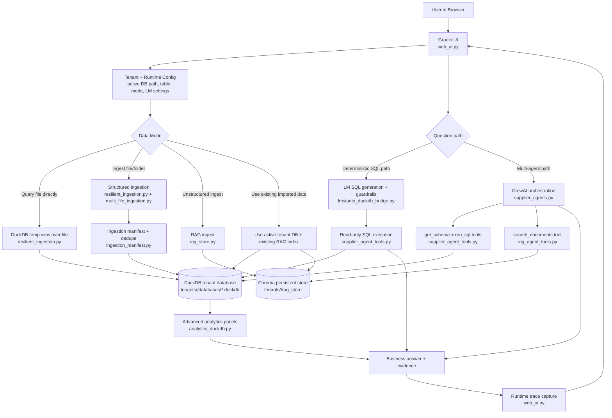

# Pricing Model Agent Pipeline Graph

## Notes

- Structured data path uses DuckDB as source of truth for analytics and SQL answers.
- Unstructured data path uses Chroma for semantic retrieval in RAG answers.
- The UI can run deterministic SQL or multi-agent hybrid (SQL + RAG) flow.
- Runtime trace records execution steps for explainability.
