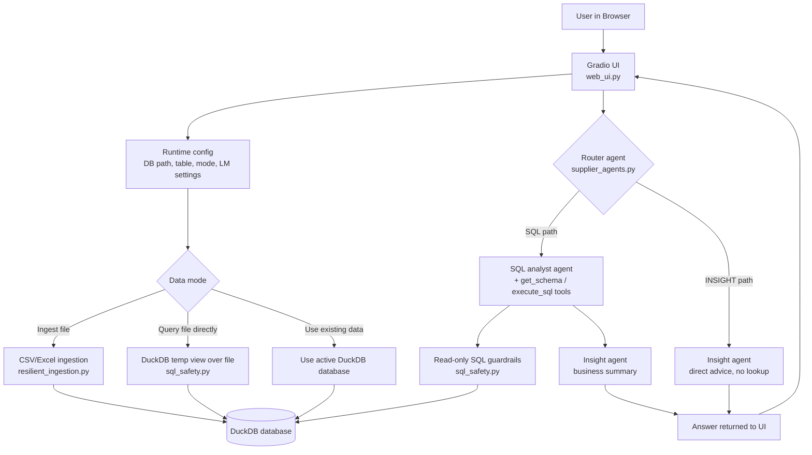

# Supplier Intelligence Agent — Pipeline Graph

## Notes

- The router **branches**: only the SQL path touches the database; the INSIGHT
  path answers directly without a dataset lookup.
- All model-generated SQL passes through the shared guardrails in `sql_safety.py`
  before execution, and existing databases are opened read-only.
- `lmstudio_duckdb_bridge.py` offers the same question→SQL→result flow without
  the agent layer, for quick testing.
